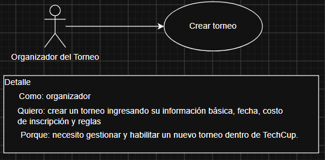
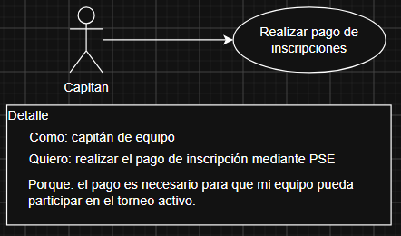
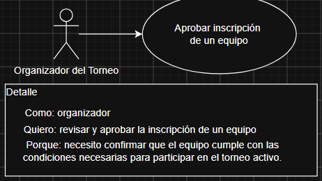

# Requerimientos del Sistema

## 1. Lista general de requerimientos

El sistema de TechCup tiene los siguientes requerimientos (descripción a alto nivel):

### 1.1 Requerimientos funcionales

El sistema de TechCup debe tener la capacidad de:

1. Permitir a los organizadores crear torneos indicando su información básica, fechas, costo de inscripción y reglas
2. Permitir a los usuarios autenticarse mediante nombre de usuario y contraseña según su rol dentro de la plataforma
3. Permitir a los capitanes crear equipos y actualizar la información de sus equipos
4. Permitir a los capitanes realizar el pago de inscripción de un equipo mediante PSE
5. Permitir a los organizadores consultar y verificar el pago realizado por un equipo
6. Permitir a los organizadores aprobar la inscripción de un equipo en el torneo activo
7. Permitir a los organizadores cambiar el estado y actualizar la información de un torneo
8. Permitir a los organizadores generar un reporte de los equipos registrados en un torneo
9. Permitir a los organizadores generar un reporte de los ingresos obtenidos por concepto de inscripciones
10. Permitir generar un reporte de pagos de inscripción en formato JSON para la Decanatura

### 1.2 Requerimientos no funcionales

El sistema de TechCup debe tener:

1. El sistema debe proteger la información de los usuarios, equipos, torneos y pagos contra accesos no autorizados
2. La interfaz del sistema debe permitir que los usuarios identifiquen fácilmente las funcionalidades disponibles según su rol
3. El sistema debe mantener la consistencia de la información de torneos, equipos, inscripciones y pagos
4. El sistema debe conservar la información registrada cuando una operación no pueda completarse correctamente
5. El sistema debe ser compatible con los principales navegadores web actuales
6. El sistema debe utilizar la paleta de colores definida para TechCup en todas sus interfaces
7. El sistema debe incluir el logo oficial de TechCUp respetando su diseño y proporciones
8. La interfaz del sistema debe adaptarse a diferentes tamaños de pantalla, incluyendo móviles y computadores

## 2. Diagramas de caso de uso

### 2.1 Requerimiento Funcional 1

| **Campo** | **Descripción** |
| ---------------------------- | ------------------------------------------------------------------------------------- |
| **ID**                       | RF-01 |
| **Nombre del requerimiento** | Crear torneo |
| **Descripción**              | El sistema debe permitir a los organizadores crear un torneo indicando su información básica, fecha, costo de inscripción y reglas. |
| **Precondiciones**           | El organizador debe estar autenticado en TechCup y debe contar con la información necesaria para crear el torneo. |
| **Actor**                    | Organizador |
| **Flujo principal**          | 1. El organizador selecciona la opción para crear un torneo. 2. El sistema solicita la información del torneo. 3. El organizador ingresa el ID, fecha, costo de inscripción y reglas. 4. El sistema valida la información ingresada. 5. El sistema registra el torneo. 6. El sistema confirma la creación del torneo. |
| **Diagrama de caso de uso**  |  |
| **Poscondiciones**           | El torneo queda registrado en el sistema y disponible para su posterior gestión |
| **Enlace a mockup**           | https://www.figma.com/proto/x8RHbRqcMo7ivZ3dBaERf4/Mock-Up-TechCUP?timeline=keyframe&node-id=12-3&p=f&t=BXFTkblyIUsT4LcP-1&scaling=scale-down&content-scaling=fixed&page-id=0%3A1 |

### 2.2 Requerimiento Funcional 2

| **Campo** | **Descripción** |
| ---------------------------- | ------------------------------------------------------------------------------------- |
| **ID**                       | RF-04 |
| **Nombre del requerimiento** | Realizar pago de inscripción |
| **Descripción**              | El sistema debe permitir a los capitanes realizar el pago de inscripción de un equipo mediante PSE. |
| **Precondiciones**           | El capitán debe estar autenticado, debe tener un equipo creado y debe existir un torneo activo. |
| **Actor**                    | Capitán |
| **Flujo principal**          | 1. El capitán selecciona la opción para realizar el pago de inscripción. 2. El sistema muestra la información y el costo de inscripción del torneo activo. 3. El capitán selecciona PSE como medio de pago. 4. El sistema envía la solicitud de pago a PSE. 5. El capitán realiza el proceso de pago. 6. PSE informa el resultado de la transacción. 7. El sistema registra la información del pago |
| **Diagrama de caso de uso**  |  |
| **Poscondiciones**           | El resultado del pago queda registrado y asociado al equipo correspondiente |

### 2.3 Requerimiento Funcional 3

| **Campo** | **Descripción** |
| ---------------------------- | ------------------------------------------------------------------------------------- |
| **ID**                       | RF-06 |
| **Nombre del requerimiento** | Aprobar inscripción de un equipo |
| **Descripción**              | El sistema debe permitir a los organizadores aprobar la inscripción de un equipo en el torneo activo. |
| **Precondiciones**           | El organizador debe estar autenticado, debe existir un torneo activo, el equipo debe estar registrado y debe existir un pago asociado a su inscripción. |
| **Actor**                    | Organizador |
| **Flujo principal**          | 1. El organizador consulta los equipos pendientes de aprobación. 2. El sistema muestra los equipos disponibles. 3. El organizador selecciona un equipo. 4. El sistema muestra la información del equipo y del pago realizado. 5. El organizador verifica el pago. 6. El organizador aprueba la inscripción. 7. El sistema registra al equipo como inscrito en el torneo activo. |
| **Diagrama de caso de uso**  |  |
| **Poscondiciones**           | El equipo queda oficialmente inscrito en el torneo activo. |

## 3. Preguntas

### 3.1 ¿Se identifica algún requerimiento que necesite ser detallado con mayor profundidad? ¿Cuál o cuáles?

Sí. El proceso de validación de pagos requiere mayor detalle, ya que no se especifica qué información debe revisar el organizador ni cuáles son las condiciones para considerar un pago válido. También debe detallarse el contenido del reporte JSON enviado a la Decanatura y la forma en que este debe ser enviado.

### 3.2 ¿Existen requerimientos que se contradigan entre sí? ¿Cuáles?

Sí. Existe una contradicción relacionada con la eliminación de torneos. En las reglas generales de negocio se establece que los torneos no pueden ser eliminados, pero en las funcionalidades generales se indica que debe ser posible eliminar un torneo y sus equipos registrados. Antes de implementar esta funcionalidad se debe aclarar cuál de las dos condiciones debe prevalecer.

### 3.3 Si tuvieran que priorizar los requerimientos, ¿cuáles 2 deberían implementarse primero?

Los dos requerimientos que deberían implementarse primero son la creación de torneos y la inscripción de equipos en el torneo activo. Estas funcionalidades representan la base del objetivo principal de TechCup, ya que sin un torneo creado no sería posible registrar equipos ni gestionar posteriormente sus pagos e inscripciones.

### 3.4 ¿Existe algún requerimiento que no debería implementarse?

Sí. No debería implementarse inicialmente la funcionalidad de eliminar un torneo y sus equipos registrados, debido a que contradice la regla de negocio que establece que los torneos no pueden ser eliminados. Una alternativa sería utilizar el estado `Cancelled` para conservar la información histórica del torneo sin permitir nuevas operaciones sobre él.
